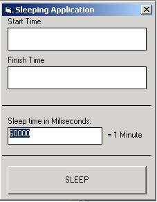

## Sleeping application

### Description

If you ever needed to make one of your hang for a period of time? well with this api you will be able to do just that :) code is well commented hope you all like it
 
### More Info
 
Time in miliseconds

             |
---                |---
**Submitted On**   |2002-10-04 06:24:04
**By**             |[Rafael Bonventi](https://github.com/Planet-Source-Code/PSCIndex/blob/master/ByAuthor/rafael-bonventi.md)
**Level**          |Intermediate
**User Rating**    |4.2 (21 globes from 5 users)
**Compatibility**  |VB 6\.0
**Category**       |[Windows API Call/ Explanation](https://github.com/Planet-Source-Code/PSCIndex/blob/master/ByCategory/windows-api-call-explanation__1-39.md)
**World**          |[Visual Basic](https://github.com/Planet-Source-Code/PSCIndex/blob/master/ByWorld/visual-basic.md)
**Archive File**   |[Sleeping\_a1404391042002\.zip](https://github.com/Planet-Source-Code/rafael-bonventi-sleeping-application__1-39523/archive/master.zip)

